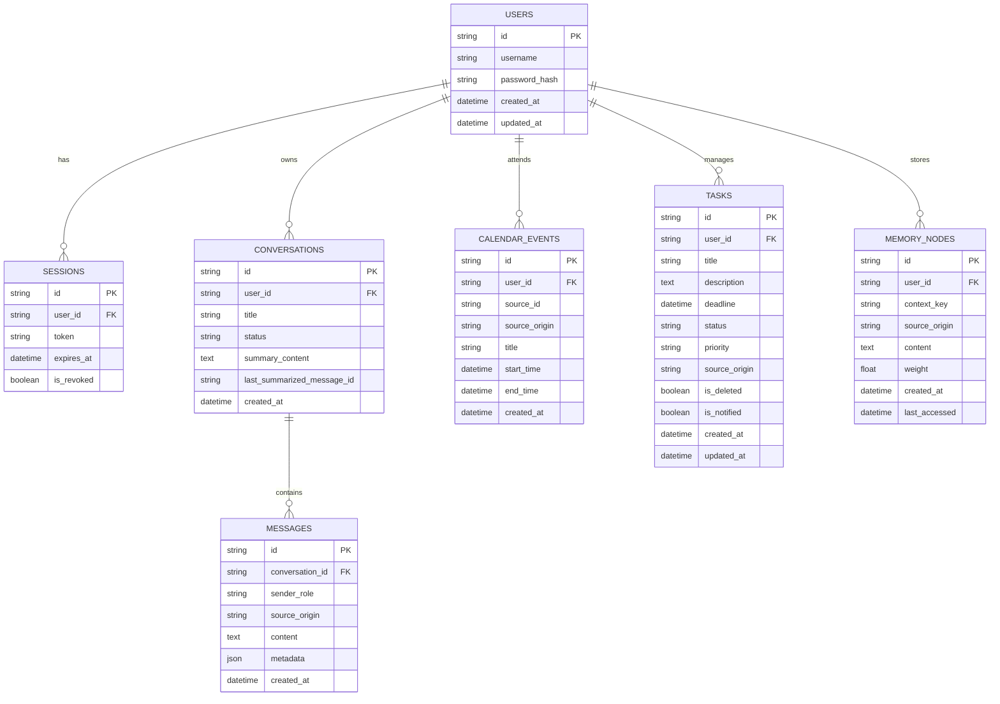

# Sơ đồ CSDL SQLite & Kiến trúc Thực thể (Database Schema)

Tài liệu đặc tả cấu trúc Cơ sở dữ liệu cho dự án Autonomous AI Assistant (AAA). Hệ thống sử dụng SQLite như một Local-first Database, tối ưu hóa cho kiến trúc Hybrid Desktop App.

## 1. Ràng Buộc Kiến Trúc & Tối Ưu Hiệu Năng
- **Chế độ WAL (Write-Ahead Logging)**: Hệ thống bắt buộc bật `PRAGMA journal_mode=WAL;` để giải quyết bài toán "database locked", cho phép luồng đọc từ UI (React/Tauri) và luồng ghi từ Background Crawler (Python) hoạt động song song.
- **Tương thích ORM**: Mọi bảng đều có cột khóa chính (Primary Key), thời gian tạo (`created_at`) và thời gian cập nhật (`updated_at`) để thuận tiện map sang SQLAlchemy (Backend) và chuẩn hóa schema bằng Pydantic.
- **Lưu trữ JSON**: Các trường không cấu trúc cố định (metadata, tags) được lưu dưới kiểu `JSON` (được SQLite hỗ trợ thông qua chuỗi text).
- **Mã hóa Application-Level (Encryption in Transit & at Rest)**: Thay vì dùng SQLCipher (có thể gây lỗi biên dịch C++ trên Windows), dự án sử dụng `cryptography.fernet` để mã hóa đối xứng (AES-128-CBC) dữ liệu Text trước khi lưu vào SQLite bằng TypeDecorator `EncryptedString`. Chỉ ứng dụng mới có khóa giải mã, đảm bảo dữ liệu nhạy cảm an toàn.

---

## 2. Sơ đồ Thực thể Kết hợp (ERD)

---

## 3. Chi Tiết Các Thực Thể (Entities Specification)

### 3.1. Nhóm Auth (Xác thực & Bảo mật)

**Bảng `users`**
Quản lý thông tin tài khoản người dùng nội bộ, sử dụng để mã hóa dữ liệu cục bộ.

| Column Name | Data Type | Constraints | Description |
| :--- | :--- | :--- | :--- |
| `id` | VARCHAR(36) | PRIMARY KEY | UUID v4 định danh người dùng. |
| `username` | VARCHAR(50) | UNIQUE, NOT NULL | Tên đăng nhập. |
| `password_hash` | VARCHAR(255) | NOT NULL | Mật khẩu đã được băm (bcrypt/argon2). |
| `is_active` | BOOLEAN | DEFAULT 1 | Trạng thái kích hoạt của tài khoản. |
| `created_at` | DATETIME | DEFAULT CURRENT_TIMESTAMP | Thời điểm tạo tài khoản. |
| `updated_at` | DATETIME | DEFAULT CURRENT_TIMESTAMP | Thời điểm cập nhật cuối. |

**Bảng `sessions`**
Quản lý phiên đăng nhập cục bộ cho ứng dụng Tauri/React.

| Column Name | Data Type | Constraints | Description |
| :--- | :--- | :--- | :--- |
| `id` | VARCHAR(36) | PRIMARY KEY | UUID v4 định danh phiên. |
| `user_id` | VARCHAR(36) | FOREIGN KEY, NOT NULL| Liên kết tới `users.id`. |
| `token` | VARCHAR(255) | UNIQUE, NOT NULL | Token xác thực (JWT hoặc ngẫu nhiên). |
| `expires_at` | DATETIME | NOT NULL | Thời điểm hết hạn token. |
| `is_revoked` | BOOLEAN | DEFAULT 0 | Đánh dấu session bị thu hồi sớm. |
| `created_at` | DATETIME | DEFAULT CURRENT_TIMESTAMP | Thời điểm tạo session. |

---

### 3.2. Nhóm Tương Tác (Hội thoại AI)

**Bảng `conversations`**
Nhóm các ngữ cảnh chat thành các luồng hội thoại độc lập (Thread).

| Column Name | Data Type | Constraints | Description |
| :--- | :--- | :--- | :--- |
| `id` | VARCHAR(36) | PRIMARY KEY | UUID v4 định danh cuộc hội thoại. |
| `user_id` | VARCHAR(36) | FOREIGN KEY, NOT NULL| Liên kết tới `users.id`. |
| `title` | VARCHAR(255) | NULL | Tiêu đề cuộc trò chuyện (AI tự tóm tắt). |
| `status` | VARCHAR(20) | DEFAULT 'active' | Trạng thái (active/archived). |
| `summary_content` | TEXT | NULL | Nội dung tóm tắt cũ của đoạn chat (Hybrid Memory). |
| `last_summarized_message_id` | VARCHAR(36) | NULL | ID của tin nhắn cuối cùng được nén vào summary. |
| `created_at` | DATETIME | DEFAULT CURRENT_TIMESTAMP | Thời điểm tạo. |
| `updated_at` | DATETIME | DEFAULT CURRENT_TIMESTAMP | Thời điểm cập nhật cuối (có tin nhắn mới). |

**Bảng `messages`**
Lưu trữ chi tiết các tin nhắn trong hội thoại NLP.

| Column Name | Data Type | Constraints | Description |
| :--- | :--- | :--- | :--- |
| `id` | VARCHAR(36) | PRIMARY KEY | UUID v4 định danh tin nhắn. |
| `conversation_id`| VARCHAR(36) | FOREIGN KEY, NOT NULL| Liên kết tới `conversations.id`. |
| `sender_role` | VARCHAR(20) | NOT NULL | Vai trò: `user`, `assistant`, `system`. |
| `source_origin`| VARCHAR(50) | DEFAULT 'user' | Truy vết Microkernel: Định danh nguồn gốc (VD: `user`, `agent_core`, `email_plugin`, `github_plugin`). |
| `content` | TEXT | NOT NULL | Nội dung chat thô. |
| `metadata` | JSON | NULL | JSON chứa tool_calls, tokens usage, context. |
| `created_at` | DATETIME | DEFAULT CURRENT_TIMESTAMP | Thời điểm tin nhắn được tạo. |

---

### 3.3. Nhóm Nghiệp Vụ AI (Tác vụ & Đồng bộ)

**Bảng `calendar_events`**
Lưu trữ thông tin lịch trình (In-app Calendar) của người dùng để nhắc nhở.

| Column Name | Data Type | Constraints | Description |
| :--- | :--- | :--- | :--- |
| `id` | VARCHAR(36) | PRIMARY KEY | UUID v4. |
| `user_id` | VARCHAR(36) | FOREIGN KEY, NOT NULL| Liên kết tới `users.id`. |
| `source_id` | VARCHAR(255) | UNIQUE, NULL | ID từ nguồn gốc (Vd: Google Event ID) chống trùng lặp. |
| `source_origin`| VARCHAR(50) | NOT NULL | Nguồn tạo ra sự kiện (VD: `agent_planner`, `email_parser`). |
| `title` | VARCHAR(255) | NOT NULL | Tên sự kiện (Họp, Học, Thi...). |
| `start_time` | DATETIME | NOT NULL | Thời gian bắt đầu. |
| `end_time` | DATETIME | NOT NULL | Thời gian kết thúc. |
| `location` | VARCHAR(255) | NULL | Địa điểm (vật lý hoặc link Zoom/Meet). |
| `created_at` | DATETIME | DEFAULT CURRENT_TIMESTAMP | Thời điểm record được AI trích xuất và tạo. |

**Bảng `tasks`**
Lưu trữ thông tin công việc (Todo List) và deadline của người dùng.

| Column Name | Data Type | Constraints | Description |
| :--- | :--- | :--- | :--- |
| `id` | VARCHAR(36) | PRIMARY KEY | UUID v4. |
| `user_id` | VARCHAR(36) | FOREIGN KEY, NOT NULL| Liên kết tới `users.id`. |
| `title` | VARCHAR(255) | NOT NULL | Tiêu đề công việc. |
| `description` | TEXT | NULL | Mô tả chi tiết. |
| `deadline` | DATETIME | NULL | Thời hạn hoàn thành công việc. |
| `status` | VARCHAR(20) | DEFAULT 'pending' | Trạng thái (`pending`, `in_progress`, `completed`). |
| `priority` | VARCHAR(20) | DEFAULT 'medium' | Mức độ ưu tiên (`low`, `medium`, `high`). |
| `source_origin` | VARCHAR(50) | DEFAULT 'user' | Nguồn tạo (`user`, `agent`). |
| `is_deleted` | BOOLEAN | DEFAULT 0 | Cờ xóa mềm (Soft delete). |
| `is_notified` | BOOLEAN | DEFAULT 0 | Đã đẩy notification deadline hay chưa. |
| `created_at` | DATETIME | DEFAULT CURRENT_TIMESTAMP | Thời điểm tạo. |
| `updated_at` | DATETIME | DEFAULT CURRENT_TIMESTAMP | Thời điểm cập nhật cuối. |

---

### 3.4. Nhóm Trí Nhớ AI (Ngữ Cảnh Dài Hạn)

**Bảng `memory_nodes`**
Kiến trúc trí nhớ dài hạn/ngắn hạn cho AI Agent, lưu các sự kiện hoặc thông tin sở thích của người dùng dưới dạng Node.

| Column Name | Data Type | Constraints | Description |
| :--- | :--- | :--- | :--- |
| `id` | VARCHAR(36) | PRIMARY KEY | UUID v4 định danh bộ nhớ. |
| `user_id` | VARCHAR(36) | FOREIGN KEY, NOT NULL| Liên kết tới `users.id`. |
| `context_key` | VARCHAR(100) | NOT NULL | Từ khóa phân loại (vd: `preference`, `fact`, `work`). |
| `source_origin`| VARCHAR(50) | NOT NULL | Vết tri thức: Do `user` nói, do `agent_core` tự suy luận, hay do `telegram_plugin` thu thập. |
| `content` | TEXT | NOT NULL | Nội dung ghi nhớ cụ thể. |
| `weight` | FLOAT | DEFAULT 1.0 | Trọng số ưu tiên/mức độ quan trọng (0.0 -> 1.0). |
| `created_at` | DATETIME | DEFAULT CURRENT_TIMESTAMP | Thời điểm tạo trí nhớ. |
| `last_accessed`| DATETIME | DEFAULT CURRENT_TIMESTAMP | Phục vụ cơ chế dọn dẹp trí nhớ quên lãng (Decay). |

---

## 4. Task Checklist Khởi Tạo Database

- [x] Thiết lập Application-level Encryption (`cryptography.fernet`) thay cho SQLCipher để tránh lỗi biên dịch trên Windows.
- [x] Định nghĩa Custom TypeDecorator `EncryptedString` cho SQLAlchemy để tự động mã hoá/giải mã các cột text nhạy cảm.
- [x] Cài đặt gói `aiosqlite` và `SQLAlchemy` (với AsyncIO support).
- [x] Thiết lập `Engine` kết nối cơ sở dữ liệu `sqlite+aiosqlite:///app_data.db`.
- [ ] Đăng ký hàm event listener khi SQLAlchemy tạo Engine để tự động bật `PRAGMA journal_mode=WAL;` và `PRAGMA synchronous=NORMAL;`.
- [ ] Định nghĩa các SQLAlchemy Declarative Base (Models) tương ứng với các bảng trên.
- [ ] Xây dựng các Pydantic schemas (Base, Create, Update, Out) cho từng Model.
- [ ] Viết Alembic migrations ban đầu (`alembic revision --autogenerate -m "init schema"`) và apply để khởi tạo schema cho file `.db`.
- [ ] Cấu hình Dependency Injection (`get_db_session`) cho FastAPI/Sidecar Process để kiểm soát transaction vòng đời an toàn.
