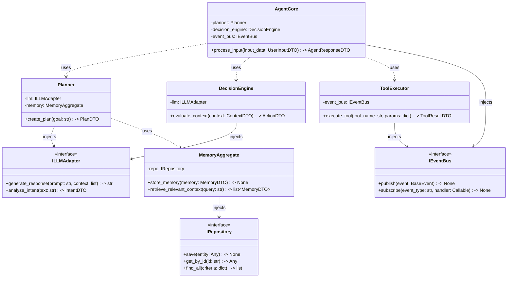

# Đặc tả Lõi Hệ thống (Domain Core Specification)

Tài liệu này đặc tả kiến trúc lõi nghiệp vụ (Domain Core) của dự án Autonomous AI Assistant (AAA), tuân thủ nghiêm ngặt nguyên lý **Dependency Inversion Principle (DIP)** và kiến trúc **Ports & Adapters (Hexagonal Architecture)**. 

Lõi hệ thống hoàn toàn cô lập, không phụ thuộc vào bất kỳ chi tiết hạ tầng nào (Database, LLM SDK, API bên ngoài). Mọi luồng dữ liệu vào/ra đều được định hình thông qua DTO (Data Transfer Object) bằng thư viện `pydantic`.

---

## 1. Sơ Đồ Lớp (UML Class Diagram)

Sơ đồ dưới đây thể hiện mối quan hệ Dependency Injection giữa các khối xử lý cốt lõi và các Interfaces (Ports).



---

## 2. Đặc Tả Chi Tiết Các Lớp Lõi (Core Classes)

### 2.1. `AgentCore` (Trái tim của hệ thống)
- **Trách nhiệm duy nhất (SRP)**: Tiếp nhận đầu vào từ người dùng hoặc hệ thống, điều phối chu trình suy nghĩ (Think) - lập kế hoạch (Plan) - hành động (Act) của AI.
- **Dependencies (Constructor Injection)**:
  - `event_bus: IEventBus`
  - `planner: Planner`
  - `decision_engine: DecisionEngine`
  - `tool_executor: ToolExecutor`
- **Public Methods**:
  - `def process_input(self, input_data: UserInputDTO) -> AgentResponseDTO:`
- **Logic hoạt động**: 
  1. Nhận `UserInputDTO` từ Adapter giao diện (UI) hoặc trigger ngầm.
  2. Gửi tín hiệu `ProcessingStartedEvent` qua `event_bus`.
  3. Gọi `decision_engine` để đánh giá ngữ cảnh và xác định hướng giải quyết.
  4. Nếu cần kế hoạch phức tạp nhiều bước, gọi `planner` để tạo chuỗi hành động (PlanDTO).
  5. Gọi `tool_executor` để định tuyến và thực thi các hành động cụ thể thông qua Plugin.
  6. Trả về `AgentResponseDTO` chứa thông tin kết quả.

### 2.2. `Planner` (Hệ thống Lập kế hoạch)
- **Trách nhiệm duy nhất (SRP)**: Phân rã mục tiêu (Goal) thành các tác vụ (Tasks/Sub-Tasks) có thể thực thi được, dựa trên năng lực của hệ thống và trí nhớ.
- **Dependencies (Constructor Injection)**:
  - `llm_adapter: ILLMAdapter`
  - `memory_aggregate: MemoryAggregate`
- **Public Methods**:
  - `def create_plan(self, goal: str) -> PlanDTO:`
- **Logic hoạt động**:
  1. Truy vấn `memory_aggregate` để lấy ngữ cảnh liên quan đến mục tiêu.
  2. Đóng gói ngữ cảnh và mục tiêu, gọi `llm_adapter` (với system prompt chuyên biệt) để sinh ra bản kế hoạch có cấu trúc.
  3. Validate output từ LLM, ép kiểu tự động thành `PlanDTO` chứa danh sách các công việc cụ thể.

### 2.3. `DecisionEngine` (Động cơ Ra Quyết Định)
- **Trách nhiệm duy nhất (SRP)**: Phân tích ngữ cảnh hiện tại và quyết định xem Agent nên phản hồi như thế nào (vd: Cần gọi Tool nào? Có nên hỏi lại người dùng để làm rõ thông tin không?).
- **Dependencies (Constructor Injection)**:
  - `llm_adapter: ILLMAdapter`
- **Public Methods**:
  - `def evaluate_context(self, context: ContextDTO) -> ActionDTO:`
- **Logic hoạt động**:
  Sử dụng LLM kết hợp hệ thống rule tĩnh (nếu đang ở mode offline) để phân loại Intent (ý định). Trả về một `ActionDTO` mang thông tin về hành động tiếp theo, chẳng hạn như `TOOL_CALL`, `DIRECT_RESPONSE`, hoặc `REQUIRE_CLARIFICATION`.

### 2.4. `MemoryAggregate` (Tổng hợp Trí nhớ AI)
- **Trách nhiệm duy nhất (SRP)**: Trừu tượng hóa quá trình lưu trữ và truy xuất ngữ cảnh (ngắn hạn/dài hạn) của Agent mà hoàn toàn không can thiệp vào cú pháp SQL.
- **Dependencies (Constructor Injection)**:
  - `repository: IRepository`
- **Public Methods**:
  - `def store_memory(self, memory: MemoryDTO) -> None:`
  - `def retrieve_relevant_context(self, query: str) -> list[MemoryDTO]:`
- **Logic hoạt động**:
  Thực hiện vector search hoặc keyword match thông qua `repository`. Trả về list các đối tượng `MemoryDTO` đã được lọc và đánh trọng số (weight).

### 2.5. `ToolExecutor` (Thực thi Công cụ)
- **Trách nhiệm duy nhất (SRP)**: Định tuyến lệnh thực thi đến các plugin/công cụ tương ứng một cách an toàn và quản lý trạng thái thực thi.
- **Dependencies (Constructor Injection)**:
  - `event_bus: IEventBus`
- **Public Methods**:
  - `def execute_tool(self, tool_name: str, params: dict) -> ToolResultDTO:`
- **Logic hoạt động**:
  Bắt exception chặt chẽ trong quá trình chạy tool bên ngoài. Bắn các sự kiện `ToolExecutionStartedEvent` và `ToolExecutionCompletedEvent` lên Event Bus để hỗ trợ truy vết Microkernel. Trả kết quả an toàn bọc trong `ToolResultDTO`.

---

## 3. Định Nghĩa Sự Kiện (Event Payloads)

Mọi luồng dữ liệu bất đồng bộ trong lõi hệ thống giao tiếp qua Event Bus sử dụng các schema `pydantic` làm payload. Dưới đây là các định nghĩa mẫu chuẩn:

```python
from pydantic import BaseModel, Field
from typing import Optional, Any
from datetime import datetime
import uuid

class BaseEvent(BaseModel):
    """Lớp cơ sở cho mọi Event truyền trong hệ thống, đảm bảo khả năng truy vết."""
    event_id: str = Field(default_factory=lambda: str(uuid.uuid4()))
    timestamp: datetime = Field(default_factory=datetime.utcnow)
    source_origin: str = Field(..., description="Nguồn phát sinh sự kiện (vd: agent_core, email_plugin)")

class NewMessageEvent(BaseEvent):
    """Sự kiện phát ra khi có tin nhắn mới xuất hiện trong hệ thống (từ user hoặc do AI/Plugin sinh ra)."""
    conversation_id: str
    sender_role: str = Field(..., pattern="^(user|assistant|system)$")
    content: str
    metadata: Optional[dict[str, Any]] = None


```

---

## 4. Task Checklist Khởi Tạo Domain Core

Để tuân thủ đúng nguyên lý DIP và Ports & Adapters, nhóm phát triển cần tạo các file Python theo cấu trúc cây thư mục sau trong giai đoạn Implementation:

- [ ] `domain/interfaces/llm_adapter.py` (Định nghĩa class abstract `ILLMAdapter`)
- [ ] `domain/interfaces/repository.py` (Định nghĩa class abstract `IRepository`)
- [ ] `domain/interfaces/event_bus.py` (Định nghĩa class abstract `IEventBus`)
- [ ] `domain/dtos/` (Thư mục chứa toàn bộ Pydantic models: `UserInputDTO`, `PlanDTO`, `ActionDTO`, `ContextDTO`...)
- [ ] `domain/events/` (Thư mục chứa `BaseEvent`, `NewMessageEvent`...)
- [ ] `domain/core/agent_core.py` (Cài đặt class `AgentCore`)
- [ ] `domain/core/planner.py` (Cài đặt class `Planner`)
- [ ] `domain/core/decision_engine.py` (Cài đặt class `DecisionEngine`)
- [ ] `domain/core/memory_aggregate.py` (Cài đặt class `MemoryAggregate`)
- [ ] `domain/core/tool_executor.py` (Cài đặt class `ToolExecutor`)

> **Cảnh báo Kiến trúc:** Các tệp `.py` nằm trong thư mục `domain/` tuyệt đối không được phép chứa các câu lệnh import từ các thư viện ORM cụ thể (như `sqlalchemy`), SDK của bên thứ 3 (như `openai`, `google.generativeai`) hoặc các framework Web (như `fastapi`). Mọi truy cập hạ tầng phải thông qua các Interfaces định nghĩa sẵn trong `domain/interfaces/`.
