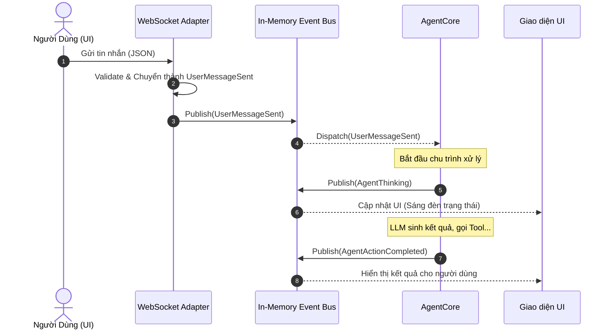

# Đặc tả Hệ thống Phân phối Sự kiện (Event Bus Specification)

Tài liệu này đặc tả cơ chế giao tiếp trung tâm (Hệ thần kinh) của dự án Autonomous AI Assistant (AAA). Áp dụng kiến trúc Event-Driven Architecture (EDA) với mô hình Pub/Sub, hệ thống sử dụng cơ chế in-memory siêu nhẹ dựa trên `asyncio.Queue`, loại bỏ hoàn toàn các Message Broker cồng kềnh nhằm tối ưu hóa cho môi trường Local Desktop.

---

## 1. Sơ Đồ Luồng Sự Kiện (Sequence Diagram)

Sơ đồ dưới đây minh họa một luồng giao tiếp tiêu biểu, từ lúc người dùng gửi tin nhắn trên UI cho đến khi UI nhận được trạng thái cập nhật từ Lõi AI thông qua Event Bus.



---

## 2. Đặc Tả Schema Sự Kiện (Event Payloads)

Mọi gói tin luân chuyển trong hệ thống bắt buộc phải được kế thừa từ một Base Event và sử dụng `pydantic` để kiểm soát chặt chẽ kiểu dữ liệu.

```python
from pydantic import BaseModel, Field
from typing import Optional, Any, Dict
from datetime import datetime
import uuid

# ==========================================
# LỚP CƠ SỞ (BASE EVENT)
# ==========================================
class BaseEvent(BaseModel):
    """Định nghĩa cấu trúc chung cho mọi sự kiện trong Event Bus."""
    event_id: str = Field(default_factory=lambda: str(uuid.uuid4()))
    timestamp: datetime = Field(default_factory=datetime.utcnow)
    source_origin: str = Field(..., description="Định danh module phát ra sự kiện")
    event_type: str = Field(..., description="Tên loại sự kiện để Router phân loại")

# ==========================================
# NHÓM 1: SỰ KIỆN HỆ THỐNG (SYSTEM EVENTS)
# ==========================================
class SystemEvent(BaseEvent):
    """Sự kiện liên quan đến vòng đời ứng dụng và các tiến trình nền."""
    status: str = Field(..., description="success, failed, warning")
    message: str

class PluginLoadedEvent(SystemEvent):
    event_type: str = "System.PluginLoaded"
    plugin_name: str
    version: str

class CrawlerFinishedEvent(SystemEvent):
    event_type: str = "System.CrawlerFinished"
    total_records_processed: int
    new_items_found: int

# ==========================================
# NHÓM 2: SỰ KIỆN TỪ NGƯỜI DÙNG (USER EVENTS)
# ==========================================
class UserEvent(BaseEvent):
    """Sự kiện sinh ra từ các thao tác trực tiếp của người dùng trên UI."""
    user_id: str

class UserMessageSentEvent(UserEvent):
    event_type: str = "User.MessageSent"
    conversation_id: str
    content: str

class SettingsChangedEvent(UserEvent):
    event_type: str = "User.SettingsChanged"
    setting_key: str
    new_value: Any

# ==========================================
# NHÓM 3: SỰ KIỆN TỪ AI LÕI (AGENT EVENTS)
# ==========================================
class AgentEvent(BaseEvent):
    """Sự kiện do AgentCore, Planner hoặc ToolExecutor phát ra."""
    correlation_id: str = Field(..., description="ID của yêu cầu gốc để trace luồng xử lý")

class AgentThinkingEvent(AgentEvent):
    event_type: str = "Agent.Thinking"
    current_action_description: str

class AgentActionCompletedEvent(AgentEvent):
    event_type: str = "Agent.ActionCompleted"
    action_id: str
    is_success: bool
    result_data: Optional[Dict[str, Any]] = None

class AlertTriggeredEvent(AgentEvent):
    event_type: str = "Agent.AlertTriggered"
    urgency_level: str = Field(..., pattern="^(low|medium|high|critical)$")
    alert_message: str
```

---

## 3. Cơ Chế Xử Lý Lỗi (Error Handling & DLQ)

Đóng vai trò là hệ thần kinh trung ương, Event Bus phải có độ chống chịu cực cao (Resilient). Một hàm xử lý sự kiện (Subscriber) bị lỗi (Exception) tuyệt đối không được phép làm treo hoặc sập toàn bộ hàng đợi sự kiện.

### 3.1. Bao Bọc Quá Trình Dispatch (Try-Catch Isolation)
Cơ chế Dispatcher vòng lặp sử dụng `asyncio.Task` hoặc `try-except` độc lập cho mỗi handler:
- Khi một Event được phân phối tới `Handler A` và `Handler B`.
- Nếu `Handler A` văng lỗi (ví dụ: mất kết nối mạng), lỗi sẽ được bắt (caught) và ghi log.
- `Handler B` vẫn tiếp tục nhận và xử lý sự kiện bình thường.

### 3.2. Dead Letter Queue (DLQ) Fallback
Nhằm đảm bảo không thất thoát các sự kiện mang tính nghiệp vụ quan trọng (như `AgentActionCompleted` hoặc `CalendarSyncRequested`):
- Khi một Handler thất bại hoàn toàn (sau 3 lần retry nếu có cơ chế retry nội bộ), Event bị đánh dấu là "Poison Pill" (sự kiện độc hại).
- Cấu trúc DLQ: Thay vì đẩy lại vào RAM (dễ gây vòng lặp vô tận), Event Bus sẽ serialize (chuyển thành JSON) sự kiện này kèm theo Call Stack Error.
- Lưu trữ cục bộ: Gọi một Repository riêng để ghi xuống một bảng `dead_letter_events` trong SQLite.
- Phục hồi (Replay): Admin hoặc Developer có thể thông qua UI Settings hoặc CLI nội bộ để xem lại log lỗi và ấn nút "Replay Event" để đưa sự kiện từ DB trở lại Event Bus để xử lý lại sau khi code đã được vá lỗi.

---

## 4. Task Checklist Khởi Tạo Event Bus

- [ ] Định nghĩa Interface `IEventBus` tại `domain/interfaces/event_bus.py`.
- [ ] Cài đặt class `LocalEventBus` tại thư mục `infrastructure/messaging/` sử dụng `asyncio.Queue` và `asyncio.create_task()` để xử lý worker loop.
- [ ] Xây dựng thư mục `domain/events/` và khai báo chi tiết các class Pydantic Schema như thiết kế trên.
- [ ] Cài đặt cơ chế bảo vệ Try-Catch bên trong vòng lặp phân phối (Dispatcher loop) của `LocalEventBus`.
- [ ] Khởi tạo bảng `dead_letter_events` trong module Database và tích hợp logic đẩy sự kiện lỗi xuống SQLite thông qua IRepository.
- [ ] Viết Unit Test giả lập một Handler tung Exception cố ý để đảm bảo Event Bus vẫn sống sót và DLQ hoạt động chính xác.
